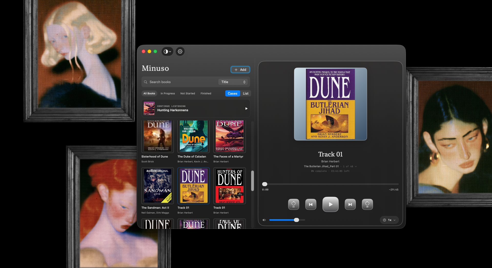

<p align="center">
  
</p>
<h1 align="center">Minuso</h1>
<p align="center">A fairly simple Audibook Player.</p>

<p align="center">
  
</p>


# Minuso

Audiobook player for macOS 14 and later.

## Build and run

```sh
swift build
swift run Minuso
```

To assemble a universal arm64 + x86_64 `.app` bundle with an ad-hoc signature:

```sh
./scripts/build_app.sh
open .build/Minuso.app
```

Kinda wanted to go about this as easy as possible , I always have my audiobooks synced via my mp3 player but time to time i like listening it on my Mac when I work , and this felt easy enough to pull off.
Add folders you already have from Settings or drop them into the window. Minuso uses read-only security-scoped bookmarks and FSEvents to rescan those locations; audio stays in its original folders and is never copied, moved, or rewritten. Minuso also stores the folder bookmarks, tags, downsampled cover art, and listening progress in its SwiftData library. It does not create a new Audiobooks folder or contact an online artwork service.

## Tests

```sh
swift test
```

## Current scope

Folder and single-file import, natural chapter ordering, title/author/embedded artwork metadata, sibling-folder cover images, search and sorting, a compact library/list view, playback and chapter selection, speed/volume controls, and saved per-book progress. Watched folders are managed in Settings. Unsupported or unreadable files are logged and skipped.
